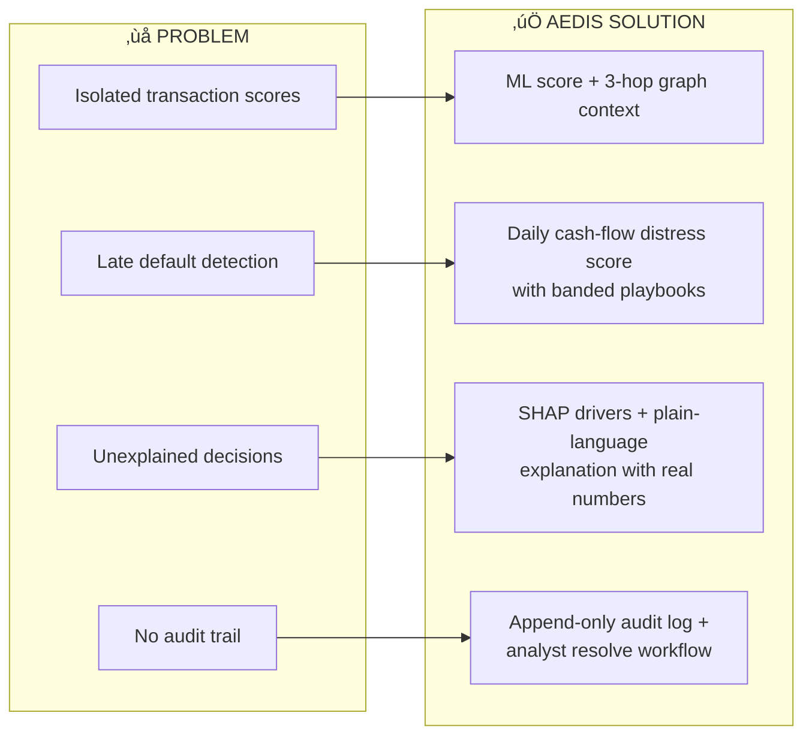
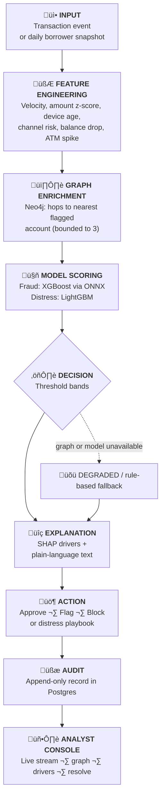
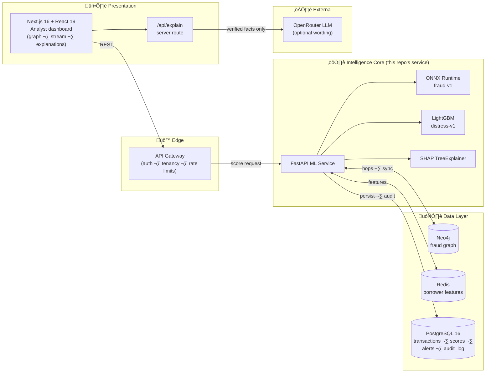
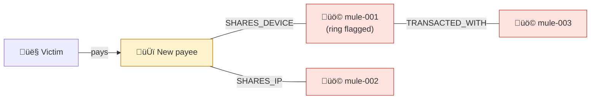
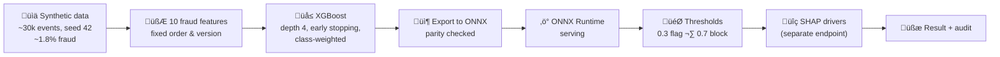
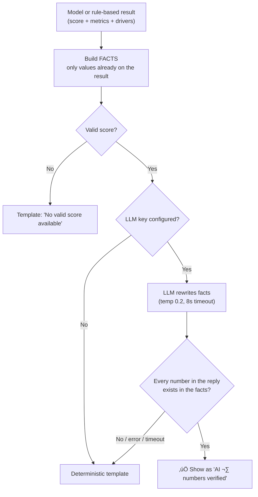
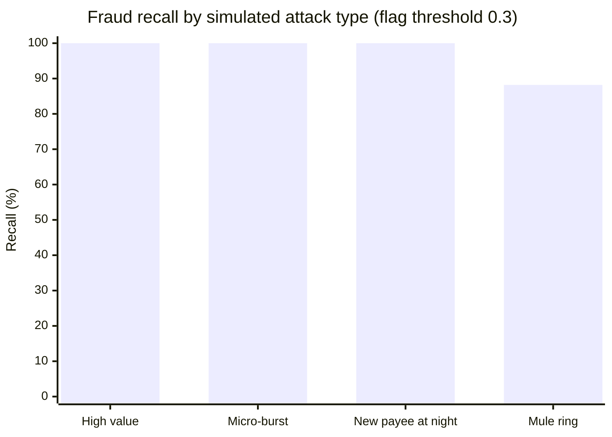

 

**Catch scam rings in real time. Warn about loan defaults weeks early. Explain every decision in plain language.**

 

  
  
  
  
  
  
  
  

  
  
  
  
  
  

  
  

 

Built for <b>Consilium '26 ∑ FINTECHSTICO</b> by the Finance &amp; Economics Society (FES), NSUT Delhi

  

---

## 1. Project Overview

**Aedis Smart Assistant** is a bank-side risk platform that does two jobs with one shared intelligence layer:

1. **Fraud & Mule Sentinel**: scores every transaction as it arrives and uses a graph database to spot *networks* of mule accounts, not just single suspicious payments.
2. **Loan Default Distress**: reads each borrower's recent cash-flow behaviour and raises an early warning before an EMI is missed.

Every score is paired with a **plain-language explanation** and **signed numeric drivers (SHAP)**, and every action an analyst takes lands in an append-only audit trail.

### What makes it different

| Typical tool | Aedis |
|---|---|
| Scores one transaction in isolation | Scores the transaction **and its place in a connected graph** of accounts, devices and IPs |
| Black-box "risk: 87%" | Number **plus** a readable reason built only from the real inputs |
| Fraud and credit risk live in separate systems | One platform, one analyst console, one audit trail |
| Silent failure when a component is down | Explicit **DEGRADED** state and a rule-based fallback, never a fake score |

### Key capabilities

| 🕸️ Graph intelligence | ⚡ Fast scoring | 🔍 Explainability | 🧾 Accountability |
|---|---|---|---|
| Bounded 3-hop mule-ring detection in Neo4j | XGBoost exported to ONNX for low-overhead inference | SHAP drivers + number-verified plain-language text | Append-only audit log with analyst resolve workflow |

**Value proposition:** analysts see *who is connected to whom*, *why* a score is high, and *what to do next* in a single screen, with nothing hidden and nothing invented.

> **Honest scope note.** All models are trained on **synthetic data**. Metrics in this document describe that synthetic benchmark, not real-bank performance. See [Section 9](#9-results-impact--demonstration).

---

## 2. Problem & Motivation

Banks fight two expensive problems that look unrelated but share the same weakness: **the warning signs are spread across many events and many accounts, and nobody sees the whole picture in time.**

```mermaid
flowchart LR
    A["<b>CURRENT SITUATION</b><br/>• Rules score one payment at a time<br/>• Fraud and credit teams use separate tools<br/>• Scores arrive without reasons"]
    B["<b>PROBLEMS</b><br/>• Mule rings split money across many accounts<br/>• Distress is noticed only after a missed EMI<br/>• Analysts cannot justify or audit decisions"]
    C["<b>UNMET NEED</b><br/>A connected, explainable, auditable view of fraud AND credit risk, early enough to act"]
    A --> B --> C
    style A fill:#f4efe6,stroke:#222,color:#111
    style B fill:#fde2e0,stroke:#c0392b,color:#111
    style C fill:#e3f4e6,stroke:#1e8449,color:#111
```

| Question | Answer |
|---|---|
| **Who feels it?** | Risk analysts, credit officers, compliance auditors, and the customers who lose savings or receive late, blunt collection calls. |
| **Why does it matter?** | A scam ring can move a victim's balance through several accounts in minutes; a late default notice costs the bank and the borrower far more than an early, gentle offer. |
| **Why do current tools fall short?** | Single-transaction rules cannot see shared devices, shared IPs or beneficiary chains. Opaque scores cannot be defended to a regulator. |
| **What motivated this project?** | Show that graph context, early cash-flow signals and honest explanations can sit in one platform that an analyst can actually trust and audit. |

---

## 3. Proposed Solution

**Core idea:** treat risk as a *connected* problem and make every answer *readable*.

### What changes for the user

| Before | With Aedis |
|---|---|
| "Transaction flagged." | "Fraud risk 87/100, blocked: the receiving account is 1 hop from a known mule and the amount is far above this customer's average." |
| Defaults found after the deadline | Borrower flagged while there is still time for a soft reminder or restructuring offer |
| Graph, model and audit in different places | One console: stream, graph, drivers, interventions, ledger |

Anyone, technical or not, can follow the loop: **see the alert ‚Üí understand why ‚Üí act ‚Üí leave a record.**

---

## 4. How the System Works

From raw event to recorded decision:

### Stage by stage

| # | Stage | What happens |
|---|---|---|
| 1 | **Input** | A transaction (amount, payee, device, IP, channel, time) or a borrower's 14-day cash-flow summary enters the system. |
| 2 | **Feature engineering** | Raw fields become model features: how unusual the amount is for this customer, burst velocity over 1 hour and 24 hours, new beneficiary, device age; for loans, balance drop %, ATM-withdrawal spike, new credit enquiries. Borrower features are cached in Redis for fast reads. |
| 3 | **Graph enrichment** | Neo4j is queried for the shortest path (max 3 hops) from the accounts involved to any account marked as part of a fraud ring. The result becomes the `graph_hops` feature. If the graph cannot answer, the value is marked unavailable and the response says `DEGRADED`. |
| 4 | **Scoring** | The fraud model outputs a probability; the distress model outputs a 0–100 score. |
| 5 | **Decision** | Fraud: **< 0.3 approve · 0.3–0.7 flag · > 0.7 block**. Distress: **LOW / MEDIUM / HIGH / CRITICAL** bands (0–39, 40–59, 60–74, 75–100). |
| 6 | **Explanation** | SHAP produces signed numeric contributions; the UI turns the real values into a short readable explanation. |
| 7 | **Action & audit** | Analysts freeze, challenge with OTP, or override with a stamp. Every step is written to an append-only audit table. |

---

## 5. System Architecture

### Components

| Component | Role |
|---|---|
| **Analyst dashboard** | Live ingestion stream, interactive fraud graph with zoom/pan, borrower register, ledger, interventions. |
| **API Gateway & workers** | Authentication, tenant isolation and asynchronous processing around the ML service (Node/TypeScript). |
| **FastAPI ML service** | One small service that owns scoring, SHAP, graph sync, dashboard analytics and the resolve workflow. Structured JSON logs, one consistent error format, readiness check that reports which models are loaded. |
| **Neo4j** | Stores accounts, devices and IPs with `TRANSACTED_WITH`, `SHARES_DEVICE`, `SHARES_IP` edges and a `fraudRingId` flag. Every query is tenant-scoped. |
| **Redis** | Borrower feature store (`borrower:{id}:features`, 25-hour TTL) so daily distress scoring avoids recomputation. |
| **PostgreSQL 16** | Multi-tenant source of truth. The app runs as a restricted role; **`audit_log` is append-only**, so records cannot be edited or deleted by the application. |
| **OpenRouter** | Optional: rewords an explanation, but only if every number in the reply exists in the supplied facts. |

---

## 6. Core Features

### 🕸️ 6.1 Graph-based mule-ring detection

A payment to a brand-new account looks harmless on its own. The graph reveals when that account shares a device or IP with a known mule.

*Technically interesting:* hop distance is **bounded to 3** and encoded as a model feature (`4` = no connection, `-1` = graph unavailable), so the model learns to behave sensibly even during a graph outage.

### üîé 6.2 Interactive graph with zoom, pan and reset

Inspect dense clusters without losing context: +/‚àí buttons, **Ctrl/Cmd + scroll** zoom toward the cursor, drag-to-pan when zoomed, `+ ‚àí 0` keyboard shortcuts, double-click reset. Clicking a node still opens the forensic inspector.

### üìâ 6.3 Early loan distress warning

A borrower with an **-82% 14-day cash drop** and a **4√ó ATM spike** is surfaced weeks before the EMI date, with a graduated playbook: *soft reminder ‚Üí moratorium offer ‚Üí credit-officer consultation*.

### 🗣️ 6.4 Plain-language explanations with verified numbers

| Raw output | Explanation shown beside it |
|---|---|
| `Fraud Risk: 87/100` | "Fraud risk is 87/100 (HIGH) and the status is BLOCKED. The score was pushed up by …" followed by the real figures. |
| `Distress: 78/100` | "Loan distress score is 78/100; cash reserves fell 82% over 14 days and ATM withdrawals rose 4√ó." |

The numbers stay visible; the text only explains them.

### üõü 6.5 Honest degradation

If the graph or model cannot answer, the system says so (`DEGRADED`, "No valid score available") and falls back to its rule-based calculation, labelled **RULE-BASED SCORE** instead of **ML MODEL SCORE**.

### üßæ 6.6 Accountable resolve workflow

Analysts can freeze escrow, challenge via OTP, or override with an audit stamp. Alerts follow a state machine and each transition is permanently logged.

---

## 7. AI / ML / Intelligence

### 7.1 Model pipeline

| Model | Task | Why this choice |
|---|---|---|
| **XGBoost → ONNX** (`fraud-v1`) | Transaction fraud probability | Strong on tabular, imbalanced data; ONNX gives lean, language-neutral serving. Exported model matches the original to within **4.8 × 10⁻⁷** max absolute difference. |
| **LightGBM** (`distress-v1`) | Borrower distress score 0–100 | Fast, accurate on a handful of cash-flow features (30/60-day balances, balance drop, ATM spike, new credit count). |
| **SHAP TreeExplainer** | Signed feature contributions | Shows *which* inputs moved the score and by how much. Returns **numbers only**; wording is a separate step. |
| **Graph features** | `graph_hops` | Captures network context that single-transaction features cannot. |

### 7.2 The explanation layer and its safeguards

**Safeguards:** no free-form prompts from the browser; strict whitelist of allowed numbers; length cap; instant template shown first and upgraded only if the LLM reply passes; the underlying ML and heuristic logic is never altered by this layer.

### 7.3 Evaluation (synthetic only)

Training and the held-out test split are both generated by the same simulator, so these figures show the pipeline works, **not** that it would detect real fraud. See [Section 9](#9-results-impact--demonstration) for the measured values.

---

## 8. User Experience / Real-World Workflow

**Scenario: a scam-ring attack hits an account.**

| Step | User goal | What they see | Benefit |
|---|---|---|---|
| 1 | Watch for suspicious activity | **Live Ingestion Stream** with risk filters (CRITICAL / HIGH / MEDIUM / LOW) | One screen for everything arriving now |
| 2 | Understand an alert | "Why is this transaction risky?" with the score, the scale and the real contributing figures | Decide in seconds, no guesswork |
| 3 | See the network | Interactive graph, click any node for the forensic inspector, zoom into a cluster | Spot the ring, not just the payment |
| 4 | Act | `[1. FREEZE ESCROW]` · `[2. CHALLENGE OTP]` · `[3. OVERRIDE & APPROVE WITH AUDIT STAMP]` | Proportionate response, always recorded |
| 5 | Credit view | Pre-default register with EMI, 14-day cash drop and ATM spike | Reach out before the missed payment |
| 6 | Audit | Immutable regulatory ledger with log IDs, actors and actions | Ready for compliance review |

The sidebar organises the console into five areas: **Fraud & Mule Sentinel · Loan Default Distress · Dual-Score Explainability · Microservices Telemetry · Risk DNA Simulator** (an interactive sandbox to test how inputs change a score).

---

## 9. Results, Impact & Demonstration

> ⚠️ **All figures below come from a SYNTHETIC test split** (last 15% of simulated events, by time). They are read directly from the trained model's metadata, not estimated. They do **not** represent real-bank performance.

### Fraud model: `fraud-v1` (4,503 test rows, 102 fraud cases)

| PR-AUC | Recall @ flag (0.3) | Precision @ flag | Precision @ block (0.7) | Recall @ block |
|:--:|:--:|:--:|:--:|:--:|
| **0.971** | **98.0%** | 69.9% | **86.2%** | 92.2% |

| Confusion matrix @ flag (0.3) | Predicted legit | Predicted fraud |
|---|:--:|:--:|
| **Actually legit** | 4,358 | 43 |
| **Actually fraud** | 2 | 100 |

The model deliberately favours **catching** fraud at the flag stage (only 2 of 102 missed) and tightens up at the block stage, where precision rises to 86%.

### Distress model: `distress-v1` (900 test rows)

| ROC-AUC | PR-AUC | Precision @ 0.5 | Recall @ 0.5 |
|:--:|:--:|:--:|:--:|
| **0.836** | 0.515 | 59.2% | 60.9% |

A modest, realistic result on a small five-feature model, which is why the distress output is framed as an **early-warning signal with human follow-up**, not an automatic decision.

### Engineering results

| Item | Result |
|---|---|
| Automated tests | **204 passing**, including an end-to-end flow against live Postgres, Redis and Neo4j |
| ONNX export fidelity | max difference **4.8 × 10⁻⁷** vs. the original XGBoost model |
| Explanation guardrails | Tested against a fake LLM: valid reply accepted; reply with an invented number rejected; server down, missing key and null score all fall back cleanly |
| Latency | The UI shows demo figures (e.g. 38.4 ms) that are **illustrative mock data**. A sub-50 ms target is a design goal and **has not been benchmarked yet**. |

### Input ‚Üí Output example

| Input | Output |
|---|---|
| Transaction `TX-SEC-9042`: large transfer, receiving account linked to the "Alpha Mule" cluster | **87/100, BLOCKED**, with a readable reason and the figures behind it |
| Borrower `LN-COMM-418-FACILITY`: -82% cash in 14 days, ATM 4√ó normal, EMI $18,400 | **Distress 78/100**, recommended action: 3-month moratorium offer via WhatsApp/SMS |

---

## 10. Technology Stack & Project Showcase

### Stack

| Layer | Technologies |
|---|---|
| **Frontend** |     |
| **ML service** |    |
| **AI / ML** |      |
| **Data** |     |
| **Infrastructure** |  |

### Showcase

| Fraud & Mule Sentinel | Loan Default Distress |
|---|---|
|  |  |

### Links

- 📦 Repository: [github.com/MawiyaManzar/Aedis_Smart_assistant](https://github.com/MawiyaManzar/Aedis_Smart_assistant)
- 🏆 Event: **Consilium '26 · FINTECHSTICO**, organised by the Finance & Economics Society (FES), NSUT Delhi

### Why it is technically valuable

Aedis combines **graph context, tabular machine learning and honest, verifiable explanations** in one auditable platform. Its distinguishing choices are the ones that matter in finance: a bounded and observable graph signal, an explicit degraded state instead of silent failure, an explanation layer that **cannot introduce a number the model did not produce**, and an append-only audit trail behind every action. It is a hackathon prototype on synthetic data, built so that each of those ideas can be tested, measured and trusted before it meets real data.

**Aedis Smart Assistant · FINTECHSTICO '26**
*Connected. Explainable. Accountable.*

