

 

<h1>A &nbsp;E &nbsp;D &nbsp;I &nbsp;S</h1>

<h3>S M A R T &nbsp;&nbsp; A S S I S T A N T</h3>

<b>&#9472;&#9472;&#9472;&#9472;&#9472;&nbsp; F I N T E C H S T I C O &nbsp;' 2 6 &nbsp;&#9472;&#9472;&#9472;&#9472;&#9472;</b>

<b><i>Risk &amp; Fraud Intelligence Platform</i></b>

 

### **Catch scam rings in real time. Warn about loan defaults weeks early. Explain every decision in plain language.**

 

  
  
  
  
  
  
  
  

  
  
  
  
  
  
  

Built for <b>Consilium '26 &middot; FINTECHSTICO</b> by the Finance &amp; Economics Society (FES), NSUT Delhi

 

<table align="center">
  <tr>
    <td align="center"><b>Graph-aware fraud detection</b></td>
    <td align="center"><b>Early loan-distress warning</b></td>
    <td align="center"><b>Number-verified explanations</b></td>
    <td align="center"><b>Append-only audit trail</b></td>
  </tr>
</table>

 

---

## 1. Project Overview

> **Aedis Smart Assistant** is a bank-side risk platform that does two jobs with one shared intelligence layer.

| | Module | What it does |
|:-:|---|---|
| **1** | **Fraud & Mule Sentinel** | Scores every transaction as it arrives and uses a **graph database** to spot *networks* of mule accounts, not just single suspicious payments. |
| **2** | **Loan Default Distress** | Reads each borrower's recent cash-flow behaviour and raises an **early warning** before an EMI is missed. |

Every score is paired with a **plain-language explanation** and **signed numeric drivers (SHAP)**. Every action an analyst takes lands in an **append-only audit trail**.

### What makes it different

| Typical tool | Aedis |
|---|---|
| Scores one transaction in isolation | Scores the transaction **and its place in a connected graph** of accounts, devices and IPs |
| Black-box "risk: 87%" | A number **plus** a readable reason built only from the real inputs |
| Fraud and credit risk live in separate systems | **One platform**, one analyst console, one audit trail |
| Silent failure when a component is down | An explicit **DEGRADED** state and a rule-based fallback, never a fake score |

### Key capabilities

<table>
  <tr>
    <th align="center">Graph intelligence</th>
    <th align="center">Fast scoring</th>
    <th align="center">Explainability</th>
    <th align="center">Accountability</th>
  </tr>
  <tr>
    <td align="center">Bounded <b>3-hop</b> mule-ring detection in Neo4j</td>
    <td align="center"><b>XGBoost</b> exported to <b>ONNX</b> for low-overhead inference</td>
    <td align="center"><b>SHAP</b> drivers plus number-verified plain-language text</td>
    <td align="center"><b>Append-only</b> audit log and analyst resolve workflow</td>
  </tr>
</table>

**Value proposition:** analysts see **who is connected to whom**, **why** a score is high, and **what to do next** on one screen, with nothing hidden and nothing invented.

> [!NOTE]
> All models are trained on **synthetic data**. Metrics in this document describe that synthetic benchmark, **not** real-bank performance. See [Section 9](#9-results-impact--demonstration).

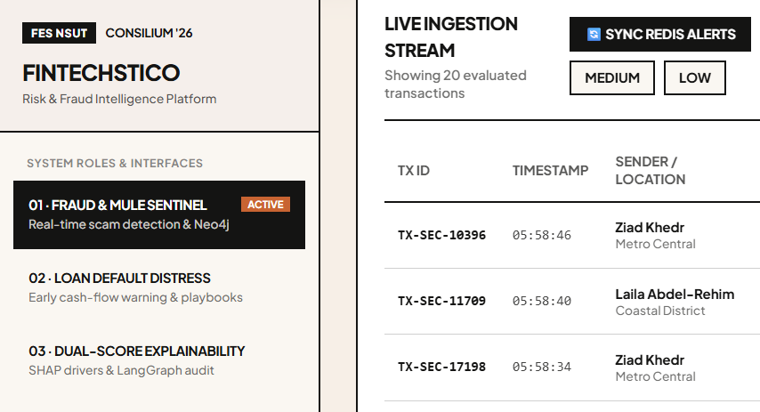
 <i>Fraud &amp; Mule Sentinel: live ingestion stream</i>

 

---

## 2. Problem & Motivation

> Banks fight two expensive problems that look unrelated but share one weakness: **the warning signs are spread across many events and many accounts, and nobody sees the whole picture in time.**

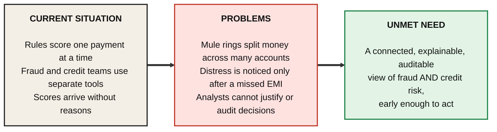

| Question | Answer |
|---|---|
| **Who feels it?** | Risk analysts, credit officers, compliance auditors, and the customers who lose savings or receive late, blunt collection calls. |
| **Why does it matter?** | A scam ring can move a victim's balance through several accounts in **minutes**. A late default notice costs the bank and the borrower far more than an early, gentle offer. |
| **Why do current tools fall short?** | Single-transaction rules cannot see **shared devices, shared IPs or beneficiary chains**. Opaque scores cannot be defended to a regulator. |
| **What motivated this project?** | To show that **graph context**, **early cash-flow signals** and **honest explanations** can sit in one platform that an analyst can actually trust and audit. |

 

---

## 3. Proposed Solution

> **Core idea:** treat risk as a *connected* problem, and make every answer *readable*.

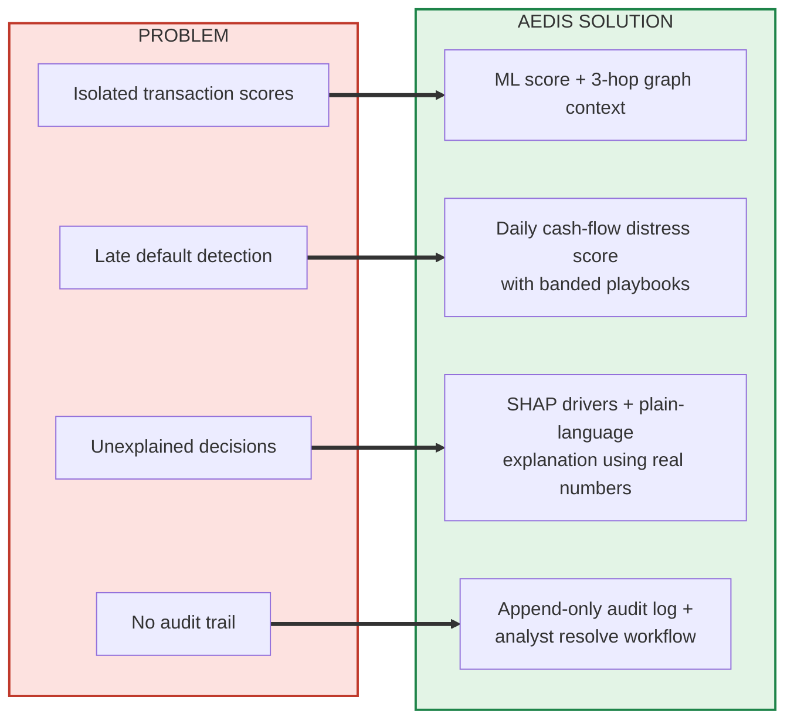

### What changes for the user

| Before | With Aedis |
|---|---|
| *"Transaction flagged."* | *"Fraud risk 87/100, blocked: the receiving account is 1 hop from a known mule and the amount is far above this customer's average."* |
| Defaults found **after** the deadline | Borrower flagged **while there is still time** for a soft reminder or restructuring offer |
| Graph, model and audit in different places | **One console**: stream, graph, drivers, interventions, ledger |

Anyone, technical or not, can follow the loop: **see the alert** &rarr; **understand why** &rarr; **act** &rarr; **leave a record**.

 

---

## 4. How the System Works

> From raw event to recorded decision, in eight stages.

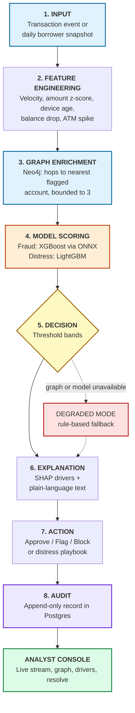

| # | Stage | What happens |
|:-:|---|---|
| **1** | **Input** | A transaction (amount, payee, device, IP, channel, time) or a borrower's 14-day cash-flow summary enters the system. |
| **2** | **Feature engineering** | Raw fields become model features: how unusual the amount is for this customer, burst velocity over 1 hour and 24 hours, new beneficiary, device age. For loans: balance drop %, ATM-withdrawal spike, new credit enquiries. Borrower features are cached in **Redis**. |
| **3** | **Graph enrichment** | Neo4j is asked for the shortest path (**max 3 hops**) from the accounts involved to any account marked as part of a fraud ring. The result becomes the `graph_hops` feature. If the graph cannot answer, it is marked unavailable and the response says **DEGRADED**. |
| **4** | **Scoring** | The fraud model outputs a probability. The distress model outputs a 0&ndash;100 score. |
| **5** | **Decision** | Fraud: **below 0.3 approve &middot; 0.3&ndash;0.7 flag &middot; above 0.7 block**. Distress: **LOW / MEDIUM / HIGH / CRITICAL** (0&ndash;39, 40&ndash;59, 60&ndash;74, 75&ndash;100). |
| **6** | **Explanation** | SHAP produces signed numeric contributions. The UI turns the real values into a short readable explanation. |
| **7** | **Action** | Analysts freeze escrow, challenge with OTP, or override with an audit stamp. |
| **8** | **Audit** | Every step is written to an append-only audit table. |

 

---

## 5. System Architecture

> Only the major components, and the direction information flows between them.

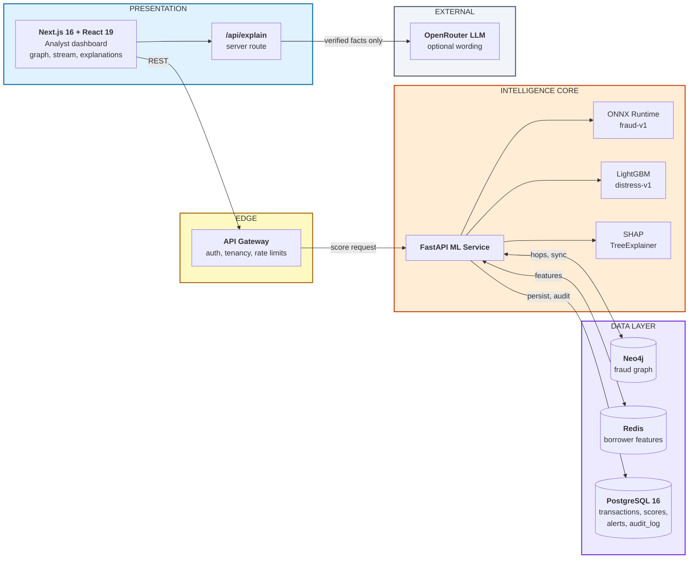

| Component | Role |
|---|---|
| **Analyst dashboard** | Live ingestion stream, interactive fraud graph with zoom and pan, borrower register, ledger, interventions. |
| **API Gateway & workers** | Authentication, tenant isolation and asynchronous processing around the ML service (Node/TypeScript). |
| **FastAPI ML service** | One service that owns scoring, SHAP, graph sync, dashboard analytics and the resolve workflow. Structured JSON logs, a single consistent error format, and a readiness check that reports which models are loaded. |
| **Neo4j** | Stores accounts, devices and IPs with `TRANSACTED_WITH`, `SHARES_DEVICE`, `SHARES_IP` edges and a `fraudRingId` flag. Every query is **tenant-scoped**. |
| **Redis** | Borrower feature store (`borrower:{id}:features`, 25-hour TTL) so daily distress scoring avoids recomputation. |
| **PostgreSQL 16** | Multi-tenant source of truth. The app runs as a restricted role and **`audit_log` is append-only**, so records cannot be edited or deleted by the application. |
| **OpenRouter** | Optional: rewords an explanation, but only if **every number** in the reply exists in the supplied facts. |

 

---

## 6. Core Features

> The capabilities that make the project worth a second look.

### 6.1 &nbsp;Graph-based mule-ring detection

A payment to a brand-new account looks harmless on its own. The graph reveals when that account shares a **device** or **IP** with a known mule.

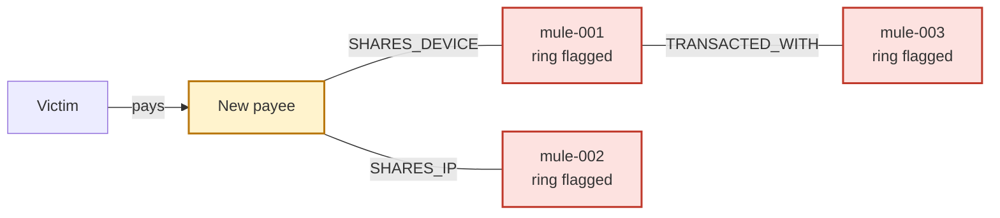

> **Technically interesting:** hop distance is **bounded to 3** and encoded as a model feature (`4` = no connection, `-1` = graph unavailable), so the model behaves sensibly even during a graph outage.

### 6.2 &nbsp;Interactive graph: zoom, pan, reset

Inspect dense clusters without losing context.

| Control | Action |
|---|---|
| **+ / &minus; buttons** | Zoom between 60% and 400% |
| <kbd>Ctrl</kbd>/<kbd>Cmd</kbd> + scroll | Zoom toward the cursor |
| **Drag** the background | Pan when zoomed in |
| <kbd>+</kbd> <kbd>-</kbd> <kbd>0</kbd> | Keyboard zoom and reset |
| **Double-click** | Reset the view |

Clicking a node still opens the forensic inspector.

### 6.3 &nbsp;Early loan-distress warning

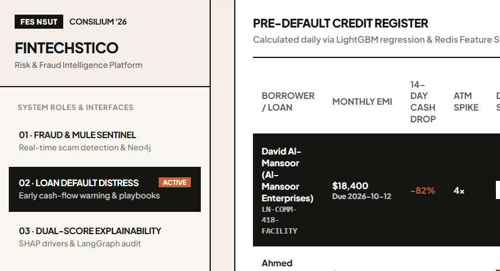
 <i>Pre-default credit register</i>

 

A borrower with an **&minus;82% 14-day cash drop** and a **4&times; ATM spike** is surfaced weeks before the EMI date, with a graduated playbook:

**Soft reminder** &rarr; **Moratorium offer** &rarr; **Credit-officer consultation**

### 6.4 &nbsp;Plain-language explanations with verified numbers

| Raw output | Explanation shown beside it |
|---|---|
| `Fraud Risk: 87/100` | *"Fraud risk is 87/100 (HIGH) and the status is BLOCKED. The score was pushed up by ..."* followed by the real figures. |
| `Distress: 78/100` | *"Loan distress score is 78/100: cash reserves fell 82% over 14 days and ATM withdrawals rose 4&times;."* |

The numbers **stay visible**. The text only explains them.

### 6.5 &nbsp;Honest degradation

If the graph or model cannot answer, the system says so (**DEGRADED**, *"No valid score available"*) and falls back to its rule-based calculation, labelled **RULE-BASED SCORE** instead of **ML MODEL SCORE**.

### 6.6 &nbsp;Accountable resolve workflow

Analysts can **freeze escrow**, **challenge via OTP**, or **override with an audit stamp**. Alerts follow a state machine and each transition is permanently logged.

 

---

## 7. AI / ML / Intelligence

> Tabular ML for the scores, a graph for context, SHAP for the "why", and guardrails around any language model.

### 7.1 &nbsp;Model pipeline

```mermaid
flowchart LR
    A["<b>Synthetic data</b><br/>~30k events, seed 42<br/>~1.8% fraud"] --> B["<b>10 fraud features</b><br/>fixed order and version"]
    B --> C["<b>XGBoost</b><br/>depth 4, early stopping,<br/>class-weighted"]
    C --> D["<b>Export to ONNX</b><br/>parity checked"]
    D --> E["<b>ONNX Runtime</b><br/>serving"]
    E --> F["<b>Thresholds</b><br/>0.3 flag, 0.7 block"]
    F --> G["<b>SHAP drivers</b><br/>separate endpoint"]
    G --> H["<b>Result + audit</b>"]
    style C fill:#ffedd5,stroke:#c2410c,stroke-width:2px
    style D fill:#e0f2fe,stroke:#0369a1,stroke-width:2px
    style G fill:#fce7f3,stroke:#be185d,stroke-width:2px
```

| Model | Task | Why this choice |
|---|---|---|
| **XGBoost &rarr; ONNX** (`fraud-v1`) | Transaction fraud probability | Strong on tabular, imbalanced data. ONNX gives lean, language-neutral serving. The exported model matches the original within **4.8 &times; 10-7** max absolute difference. |
| **LightGBM** (`distress-v1`) | Borrower distress score 0&ndash;100 | Fast and accurate on a handful of cash-flow features (30/60-day balances, balance drop, ATM spike, new credit count). |
| **SHAP TreeExplainer** | Signed feature contributions | Shows **which** inputs moved the score and by how much. Returns **numbers only**; wording is a separate step. |
| **Graph features** | `graph_hops` | Captures network context that single-transaction features cannot. |

### 7.2 &nbsp;The explanation layer and its safeguards

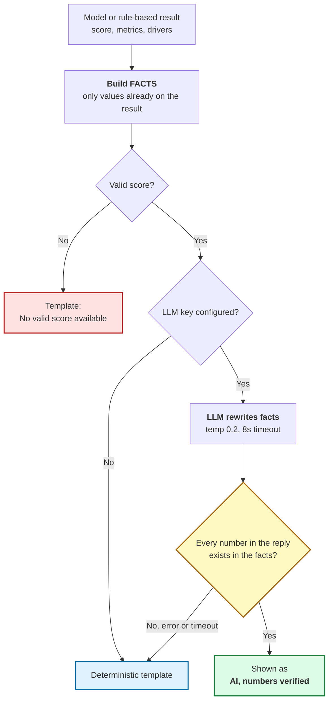

**Safeguards**

- **No free-form prompts** from the browser; only structured facts are accepted.
- **Strict number whitelist:** a reply containing any number not in the facts is rejected.
- **Length cap**, plus instant template text shown first and upgraded only if the LLM reply passes.
- The underlying ML and heuristic logic is **never altered** by this layer.

### 7.3 &nbsp;Evaluation (synthetic only)

Training and the held-out test split are generated by the same simulator, so the figures show that the pipeline works, **not** that it would detect real fraud. Measured values are in [Section 9](#9-results-impact--demonstration).

 

---

## 8. User Experience / Real-World Workflow

> **Scenario:** a scam-ring attack hits an account.

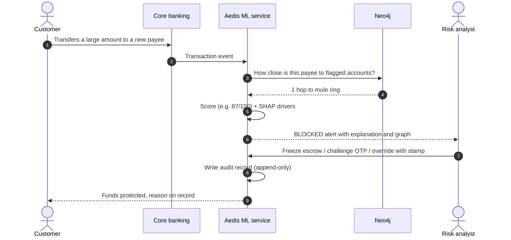

| Step | User goal | What they see | Benefit |
|:-:|---|---|---|
| **1** | Watch for suspicious activity | **Live Ingestion Stream** with risk filters (CRITICAL / HIGH / MEDIUM / LOW) | One screen for everything arriving now |
| **2** | Understand an alert | **"Why is this transaction risky?"** with the score, the scale and the real contributing figures | Decide in seconds, no guesswork |
| **3** | See the network | Interactive graph; click any node for the forensic inspector; zoom into a cluster | Spot the ring, not just the payment |
| **4** | Act | `[1. FREEZE ESCROW]` &middot; `[2. CHALLENGE OTP]` &middot; `[3. OVERRIDE & APPROVE WITH AUDIT STAMP]` | Proportionate response, always recorded |
| **5** | Credit view | Pre-default register with EMI, 14-day cash drop and ATM spike | Reach out **before** the missed payment |
| **6** | Audit | Immutable regulatory ledger with log IDs, actors and actions | Ready for compliance review |

The console is organised into five areas: **Fraud & Mule Sentinel** &middot; **Loan Default Distress** &middot; **Dual-Score Explainability** &middot; **Microservices Telemetry** &middot; **Risk DNA Simulator** (an interactive sandbox to test how inputs change a score).

 

---

## 9. Results, Impact & Demonstration

> [!WARNING]
> All figures below come from a **SYNTHETIC** test split (the last 15% of simulated events, by time). They are read directly from the trained models' metadata, not estimated, and they do **not** represent real-bank performance.

### 9.1 &nbsp;Fraud model: `fraud-v1`

4,503 test rows, 102 fraud cases

<table>
  <tr>
    <th align="center">PR-AUC</th>
    <th align="center">Recall @ flag (0.3)</th>
    <th align="center">Precision @ flag</th>
    <th align="center">Precision @ block (0.7)</th>
    <th align="center">Recall @ block</th>
  </tr>
  <tr>
    <td align="center"><h3>0.971</h3></td>
    <td align="center"><h3>98.0%</h3></td>
    <td align="center"><h3>69.9%</h3></td>
    <td align="center"><h3>86.2%</h3></td>
    <td align="center"><h3>92.2%</h3></td>
  </tr>
</table>

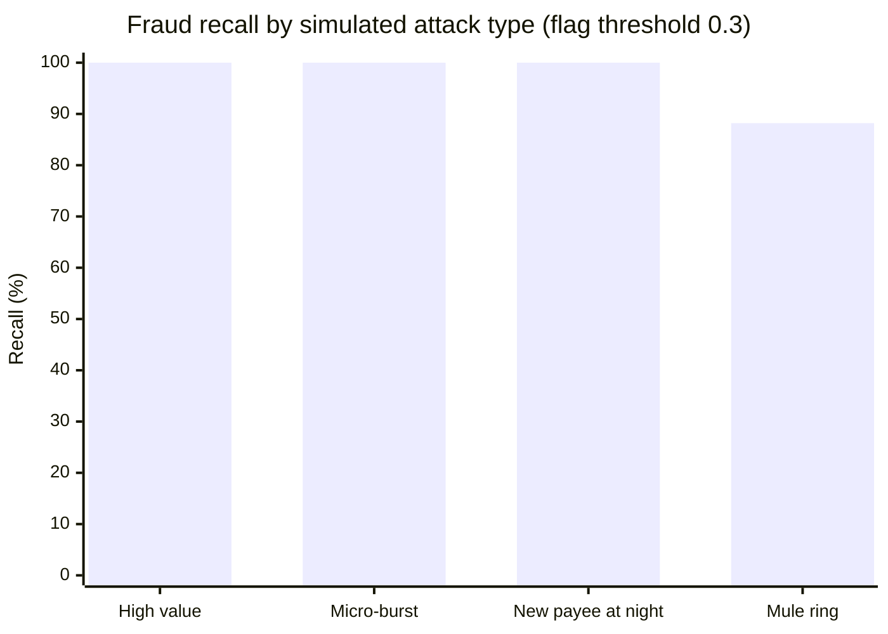

| Confusion matrix @ flag (0.3) | Predicted legit | Predicted fraud |
|---|:-:|:-:|
| **Actually legit** | 4,358 | 43 |
| **Actually fraud** | 2 | 100 |

The model deliberately favours **catching** fraud at the flag stage (only 2 of 102 missed) and tightens up at the block stage, where precision rises to **86%**.

### 9.2 &nbsp;Distress model: `distress-v1`

900 test rows

<table>
  <tr>
    <th align="center">ROC-AUC</th>
    <th align="center">PR-AUC</th>
    <th align="center">Precision @ 0.5</th>
    <th align="center">Recall @ 0.5</th>
  </tr>
  <tr>
    <td align="center"><h3>0.836</h3></td>
    <td align="center"><h3>0.515</h3></td>
    <td align="center"><h3>59.2%</h3></td>
    <td align="center"><h3>60.9%</h3></td>
  </tr>
</table>

A modest, realistic result for a small five-feature model. That is why the distress output is framed as an **early-warning signal with human follow-up**, not an automatic decision.

### 9.3 &nbsp;Engineering results

| Item | Result |
|---|---|
| **Automated tests** | **204 passing**, including an end-to-end flow against live Postgres, Redis and Neo4j |
| **ONNX export fidelity** | Max difference **4.8 &times; 10-7** vs. the original XGBoost model |
| **Explanation guardrails** | Tested against a fake LLM: a valid reply is accepted; a reply with an invented number is rejected; server down, missing key and null score all fall back cleanly |
| **Latency** | The UI shows demo figures (for example 38.4 ms) that are **illustrative mock data**. A sub-50 ms target is a design goal and **has not been benchmarked yet**. |

### 9.4 &nbsp;Input &rarr; output examples

| Input | Output |
|---|---|
| Transaction `TX-SEC-9042`: large transfer, receiving account linked to the "Alpha Mule" cluster | **87/100, BLOCKED**, with a readable reason and the figures behind it |
| Borrower `LN-COMM-418-FACILITY`: &minus;82% cash in 14 days, ATM 4&times; normal, EMI $18,400 | **Distress 78/100**, recommended action: 3-month moratorium offer via WhatsApp/SMS |

 

---

## 10. Technology Stack & Project Showcase

> The tools behind the platform, grouped by layer.

| Layer | Technologies |
|---|---|
| **Frontend** |     |
| **ML service** |    |
| **AI / ML** |      |
| **Data** |     |
| **Infrastructure** |  |

### Showcase

<table>
  <tr>
    <th align="center">Fraud &amp; Mule Sentinel</th>
    <th align="center">Loan Default Distress</th>
  </tr>
  <tr>
    <td></td>
    <td></td>
  </tr>
</table>

### Links

| | |
|---|---|
| **Repository** | [github.com/MawiyaManzar/Aedis_Smart_assistant](https://github.com/MawiyaManzar/Aedis_Smart_assistant) |
| **Event** | **Consilium '26 &middot; FINTECHSTICO**, organised by the Finance & Economics Society (FES), NSUT Delhi |

### Why it is technically valuable

> Aedis combines **graph context**, **tabular machine learning** and **honest, verifiable explanations** in one auditable platform.
>
> Its distinguishing choices are the ones that matter in finance: a **bounded and observable graph signal**, an **explicit degraded state** instead of silent failure, an explanation layer that **cannot introduce a number the model did not produce**, and an **append-only audit trail** behind every action.
>
> It is a hackathon prototype on synthetic data, built so that each of those ideas can be tested, measured and trusted before it meets real data.

 

**Aedis Smart Assistant &middot; FINTECHSTICO '26**

*Connected. Explainable. Accountable.*

